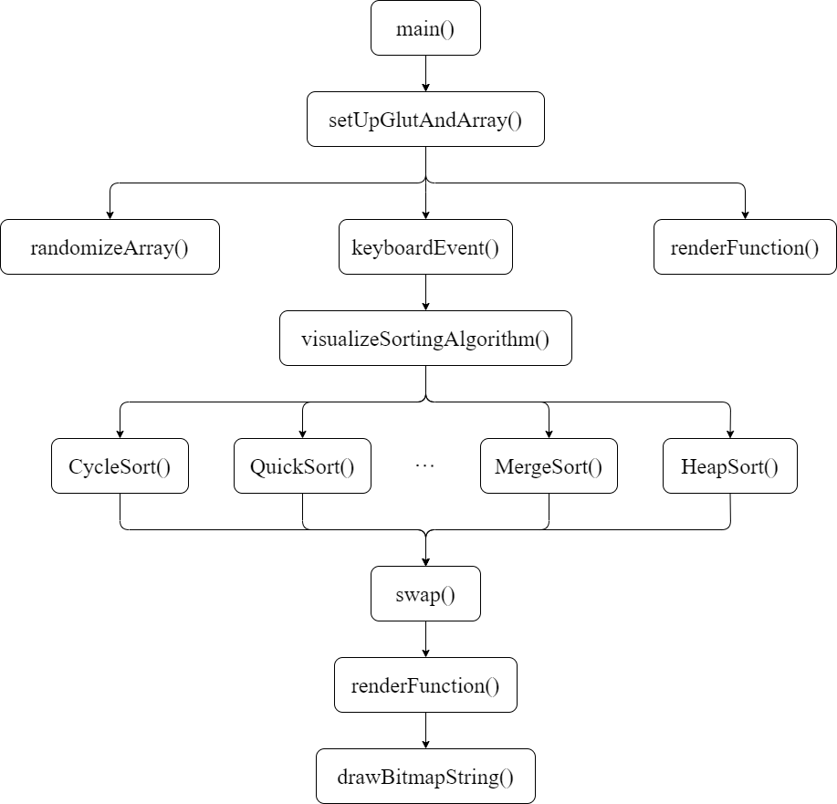

# Sorting Algorithm Visualizer
## OVERVIEW
Analysis and design of algorithms is a great challenge for both computer and information science students. Fear of programming, lack of interest, and the abstract nature of the programming concepts are the main cause of the high dropout and failure rates in introductory programming courses. With an aim to motivate and help students, a Sorting Algorithm visualizer has been created. The sorting algorithm visualizer illustrates how algorithms work graphically. It mainly aims to simplify and deepen the understanding of algorithms operations.    
The user is given an option to choose between 10 sorting algorithms. After choosing one, a window pops up displaying the algorithm at work. It shows the movement of each individual element, involved in the sort. The movements of these elements are based on the algorithm chosen by the user. And it shows the number of comparisons and number of swaps as the sorting continues. After the soring concludes, the terminal displays the total time taken by the algorithm to sort.
## ALGORITHM
The entire design process can be explained using a simple algorithm. The algorithm gives a detailed description of the design process of the ‘Sorting Algorithm visualizer’. The various steps involved in the design of the ‘Sorting Algorithm visualizer’ are as shown below:
- Step 1: Start
- Step 2: Set delay → 50000; length → 100
- Step 3: randomizeArray() – Shuffles the array contents (creates unsorted Array)
- Step 3: Set initial Display Mode.
- Step 4: Set initial Window Size to (1500, 750).
- Step 4: Set initial Window Position to (200, 20).
- Step 5: Create a Window “Sorting Algorithm Visualization”.
- Step 6: keyboardEvent()
    - If the ‘Esc’ key is pressed:
      - Exit the Display.
    - If the ‘S|s’ key is pressed:
      - Call the visualizeSortingAlgorithm() and display the output.
      - Print the time taken by the function to complete the sorting.
- Step 7: visualizeSortingAlgorithm()
    - Call the Specific Sorting function.
    - Call renderFunction() to display the output.
- Step 8: renderFunction()
    - Set clear to clear the buffer.
    - Call drawBitmapString() to print the SortName, Comparison, and Swapping.
    - Display sequence of columns based on the values in the array.
    - Call glFlush().
- Step 9: Stop.
## FLOW CHART
A flow diagram is a common type of chart that represents an algorithm or process showing the steps as boxes of various kinds, and their order by connecting these with arrows. Flow diagrams are used in analysing, designing, documenting or managing a process or program in various fields. The following Flow Diagram shows the processing of different operations in this project:   

## IMPLEMENTATION
- randomizeArray():
  - This function is used to shuffle the values in the arrays creating an unsorted array.
- keyboardEvent():
  - This function takes the key input to perform start or quit operations.
- visualizeSortingAlgorithm():
  - This function calls the sorting algorithm function based on the input.
- renderFunction():
  - This function renders the rectangle and prints it on the screen.
- drawBitmapString():
  - This function prints the text on the screen.

The sorting algorithms used in this mini-project are **Cycle Sort**, **Selection Sort**, **Radix Sort**, **Quick Sort**, **Heap Sort**, **Merge Sort**, **Bubble Sort**, **Insertion Sort**, **Cocktail Sort**, and **Gnome Sort**.
## SNAPSHOTS
## FUTURE ENHANCEMENT
The currently developed project can improve in many areas. Time constraints and deficient knowledge have been major factors in limiting the features offered by this display model.
Some of the ideas to be implemented are:
- Add more sorting algorithms.
- Take input from the user for speed and number of items in the array.
- Feature for comparison between the algorithms to display the performance.
- Take input from the user for changing the colour of the columns in the output.

If you have any doubt related to this project, feel free to contact me [Twitter](https://twitter.com/sh0ck_thi) or [mail](mailto:thirumalaishaktivel@gmail.com) me.
